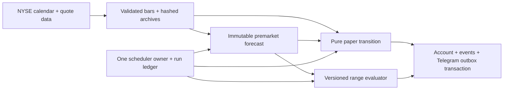

# $100 intraday paper trader

User decisions recorded September 28, 2026: forecast SPY, QQQ, SMH and XLE every eligible
session; score simulated trades after costs; update during the first four hours; trade
only when conditions qualify; stay out of bearish calls; generic simulator on this Mac.
Starting capital is USD 100 total. No options, shorts, leverage or real broker orders.

## Frozen first policy

`orb-vwap-long-v1` is an unvalidated opening-range/VWAP hypothesis, preregistered as trial
16 in `scratch/openclaw_research_loop/TRIAL_LEDGER.md`. It has not passed a profitability
backtest. Parameters must not be changed in place after observing returns; register a
new trial and account/version for any strategy change.

| Rule | Initial setting |
|---|---|
| Main account | `etf-paper-100`, USD 100 starting equity |
| Position | At most one open long across the four ETFs |
| Planned loss per trade | At most $0.25 including assumed entry and stop-exit friction |
| Daily loss trigger | $1 decrease from session starting equity; halt further entries |
| Entry count | At most four fills per session; no minimum |
| Entry window | First decision at 09:50 ET; no entries at/after 13:00 |
| Exit deadline | 13:30 ET, using the final completed minute close |
| Initial stop | Low of the 09:30–09:45 opening range |
| Target | Signal price + twice the signal-price-to-stop distance |
| Modelled costs | 5 basis points per side; no fixed commission in the base case |
| Size | Fractional ETF shares to four decimals; minimum $5 notional |

All four receive a daily UP/DOWN forecast when required data is available. A missing
forecast is an operational failure, recorded as missing rather than silently skipped.
NYSE holidays and sessions closing before 13:30 are excluded from this four-hour cohort.

Entry requires the immutable current-version premarket forecast to be UP, a completed
five-minute close crossing above the first 15-minute high, and price above session VWAP
and the session open. VWAP uses typical price `(high + low + close) / 3` and regular-session
volume. If several qualify simultaneously, SPY, QQQ, SMH, XLE is the fixed priority.

Order quantity, stop, target and maximum entry price are fixed when the signal is observed.
The generic fill assumption is a one-shot limit order at the next minute open following
submission; an open above the committed risk/cash ceiling cancels it. The fill is recorded
only after that minute completes. Minimum size and net reward/risk are checked again.
An order expires after 180 seconds if its intended fill would occur after that deadline.
Once a submitted order could have filled, missing data leaves it unresolved: restarting
must verify its path, even when that reveals a loss. No past signal creates a new order
retrospectively.

Exits use completed one-minute OHLC. A previously requested market exit uses the next
minute open. Otherwise a bar touching both stop and target is scored stop-first. A gap
below the stop exits at the worse opening price. Two completed closes below cumulative
session VWAP request an exit. Daily loss and time exits use the observed minute close.
Stop/target times are known only to minute precision. Gaps and assumed fills can exceed
planned loss; $0.25 and $1 are controls, not guaranteed loss ceilings.

Generic assumptions include immediate simulated buying-power reuse, fractional orders,
adequate liquidity, no queue modelling and no settlement restrictions. These must be
replaced with the user's actual broker/account rules before considering real execution.

## Components and recovery



`intraday_operations` runs each minute and once at startup. It retries forecasts only
09:15–09:30 ET, catches missed sessions without backfilling them, and retries unresolved
scores after their observation windows. Unlike the legacy timeout wrapper, its scheduler
instance remains occupied until the actual work finishes. A separate watchdog reports
work lasting over 90 seconds. One backend process owns this experiment; multi-process
scheduler deployment is not supported.

Account changes, audit events and trade notifications commit together. Row locks serialize
account updates and unique event identities prevent double accounting. Restart preserves
cash, positions and orders. Missing minutes leave the position unresolved and equity
potentially stale; the system does not invent a favorable exit. Recovery may later score
previously placed simulated stops/time exits from a complete path, marked by the later
observation time in the audit record. New entries are never invented during an outage.

Telegram messages use a durable outbox, with acknowledgment by the existing poller.
Delivery is **at least once**: a crash after Telegram accepts a message but before the
acknowledgment can repeat a message. An unavailable database also prevents outbox writes;
the existing host/dependency monitoring remains necessary. Keep this Mac, PostgreSQL and
OpenD running during the session. No credentials were moved into documentation.

OpenD connection attempts are shared across callers, with an eight-second caller
wait and cleanup before replacement. A constructor still retrying inside the SDK
remains the single owned attempt; further calls do not create extra connections.
Closing the service invalidates a pending attempt so it cannot publish a late
connection. SDK queries wait at most five seconds for connectivity, in addition to
the SDK's request timeout. A backend restart can still be needed for a constructor
that never returns. The September 29 connection-exhaustion incident and recovery
evidence are recorded under `data/intraday_incidents/2026-09-29/`.

## Judging whether it helps

The primary score is net account return after costs, alongside drawdown, trade count,
costs and unresolved data. A second, independent hypothetical $100 account
`etf-paper-100-no-forecast` applies identical rules without requiring the daily call to be
UP; both require an available premarket forecast to keep the observation cohort aligned.
It is a comparison, not another deposit or part of the main account. Staying in cash is
the $100 benchmark. A winning forecast or target touch alone is not a profitable trade.

The report reprices closed trades at 25 bps round trip and at $1 per order. This is cost
sensitivity on the same fills, not a fresh strategy simulation: different real costs
could change entry eligibility, sizing and fills.

Keep the first policy frozen while collecting data. Review operations immediately when
errors occur. Review performance after at least 60 eligible sessions and, if available,
100 closed trades; fewer trades means the evidence remains sparse. Those counts are a
review checkpoint, not proof of an edge. Compare paired session returns against both
benchmarks, examine uncertainty by session (the four ETFs are correlated), and reserve
future sessions for any retuned policy. No automatic real-trading promotion exists.

## Inspect and reproduce

- `GET /api/paper-experiment`: cash/equity, positions, costs, drawdown and comparisons.
- `GET /api/paper-experiment/events?limit=100`: observations, signals, orders, fills and gaps.
- `GET /api/intraday-operations`: expected runs, errors, watchdog state and pending messages.
- `GET /api/intraday-forecasts/summary`: version-isolated forecast metrics and missing days.

Base URL: `http://127.0.0.1:3001`. Telegram sends per-ETF forecasts and audits, main-account
entries/exits, operational failures and a daily paper report after 13:40 ET.
Telegram `!stats` and the existing morning/evening stats pushes now summarize this paper
account and the corrected forecast cohort. Legacy prediction statistics remain available
through their original track-record endpoints.

Every observation saves its prior/resulting account state, signal views, event identities,
raw-data manifests and implementation digest. Archives live under `data/intraday_market`.
Replay verifies hashes and runs the same pure transition without network calls or writes:

```bash
venv/bin/python -m scripts.replay_intraday_paper --limit 500
```

Use the recorded implementation version for replay. A changed digest is rejected rather
than silently comparing different code. This verifies recorded execution decisions; it
does not establish forecast skill or reproduce unavailable historical news.

## Evidence and trade explanations, October 3, 2026

The diagnostics upgrade leaves `orb-vwap-long-v1`, account balances, forecast weights,
entry/exit rules and risk limits unchanged. It does not activate a challenger strategy.

New RSS articles retain a nullable `published_at` in addition to collection time.
Startup applies an idempotent additive migration; historical dates are not guessed or
backfilled. Direct sentiment with no matching inputs is labelled `NO_DATA`; its numeric
zero fallback is retained for the frozen model. Feed/database failures are distinct from
neutral sentiment. Social publication times are unknown where only scrape time exists.

Forecast responses expose `model_score`, `score_calibration` and `evidence_quality`.
Telegram labels the score as `/100`, not a measured probability. Evidence status is
`fresh`, `stale`, `missing`, `unknown`, `partial`, `unavailable`, or `not_recorded`.
Freshness uses the existing 48-hour lookback against publication time, not scrape time;
it does not establish complete feed coverage, relevance, independence, or predictive skill.
Future-dated evidence is flagged. Duplicate normalized headlines and tracking URLs count
once in diagnostic coverage. This detects exact repeated stories, not every paraphrased
syndicated article. Frozen model weights still consume the original rows. Direct sentiment
and driver evidence overlap and must not be added as independent evidence counts.
Historical quality is derived only from saved issuance inputs, never today's news.

`GET /api/paper-experiment` adds per-account `diagnostics`: closed trade entry/exit
explanations, recorded signal values, planned risk, price P&L, costs, net P&L and accounting
reconciliation. Forecast alignment uses the verified regular-session open when available;
the historical excursion IQR is not a price ceiling or a calibrated profit target.
Favorable/adverse excursions use hash-verified saved minute bars. Missing/corrupt paths
remain unverified. Stop/target exits report lower bounds excluding the ambiguous exit
minute's extrema; the OHLC path cannot establish whether those extrema preceded the fill.
Session totals and the cash benchmark use that session's actual starting equity, separate
from cumulative results. Comparator trades remain separate. Daily messages identify their
forecast statistics as cumulative; descriptive score buckets report both forecast count
and distinct session count, without fitting or claiming calibrated probabilities.

The prior engine was preserved locally, before edits, at
`data/intraday_implementations/c3c389ae612701e3de71fb5a263b2d2802598bdca21cd322375da8585d3fca27/`.
Its `replay.py` uses those preserved modules with the normal replay arguments. Use it for
observations with that digest; use the current replay command for the new implementation.
Mixed versions must be checked with their recorded implementation, not by disabling hashes.
The archive is runtime evidence and should be included when backing up the experiment.

Next strategy work must register a separate trial/version before observing its test
outcomes, change one hypothesis at a time, and compare paired future-session net returns
against this frozen account, its no-forecast comparator, and cash. Diagnostics alone
do not establish a profitable edge.

## Activation verification, September 28, 2026

The backend and Telegram poller were restarted; health, OpenD connectivity, scheduler
ownership and the loaded implementation digest were checked. Live input capture passed
for all four ETFs with 82 complete prior sessions apiece. All eight historical forecasts
remain byte-equivalent as serialized records, with separate 48-bar regrades. Both
hypothetical accounts begin at $100 and zero trades. The activation message and updated
paper `!stats` report were acknowledged by Telegram's poller.

The relevant regression suite passed 65 checks. Following the final pending-order
recovery correction, the affected paper/operations suite passed 34 checks; following
the `!stats` change, its operations suite passed 21. These overlap: 68 distinct checks
in total, including 46 forecast/paper/operations cases and 22 existing regression cases.
One obsolete API assertion and a TA test that called a falling-price fixture an uptrend
were corrected; the committed and current TA scoring behavior was verified identical.

Reproduce the experiment checks with:

```bash
venv/bin/python -m pytest tests/test_intraday_forecast.py tests/test_intraday_paper.py tests/test_intraday_operations.py -q
```

Detailed activation evidence lives in `data/intraday_reports/activation-verification-2026-09-28.json`.
No complete forward trading session has been observed at activation. Functional checks
and successful data access establish operational readiness for the experiment, not a
profitable strategy.
