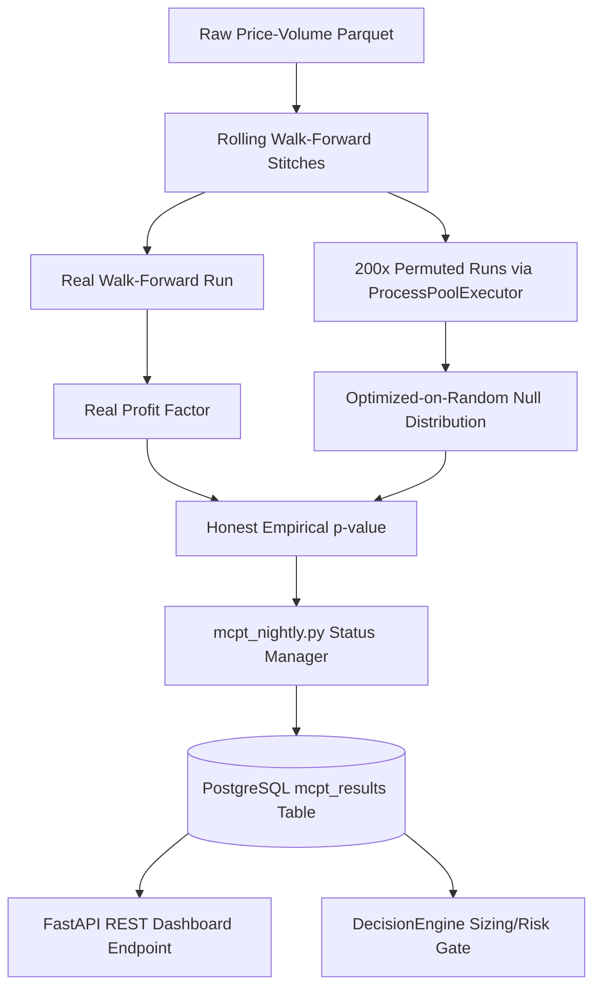

# Monte Carlo Permutation Test (MCPT) Validation Framework

This directory houses the **Monte Carlo Permutation Test (MCPT) Framework**, which serves as our production risk-gating system for trading strategies. It ensures that any active strategy (or signal aggregator) holds a genuine statistical edge ($p < 0.05$) rather than being the product of data-dredging, temporal overfitting, or selection bias.

---

## 1. Architectural Overview

The framework evaluates strategies through two validation pipelines:
1.  **In-Sample Validation (`validator.py`):** Runs a stationary permutation test over the full dataset to establish initial statistical plausibility.
2.  **Out-of-Sample Walk-Forward Validation (`walkforward.py` & `validator.py`):** Symmetrically re-runs the entire parameter-optimization process over a rolling Out-of-Sample (OOS) rolling timeline.



### Core Components
*   **`bar_permute.py`**: Implements a high-fidelity **Volume Shuffle Index** permuter. It scrambles returns while preserving individual bar structures (open-high-low relations) to prevent creating unphysical trading bars.
*   **`optimizer.py`**: Executes parallel grid search optimizations. Features a **30x speedup** through pre-calculated Exponential Weighted Moving Averages (Wilder's smoothing) for RSI.
*   **`validator.py`**: Coordinates the parallel test suite utilizing python's `ProcessPoolExecutor` to scale child validation processes across all available CPU cores.
*   **`walkforward.py`**: Implements a rolling walk-forward emulator. It splits the timeline into lookback training windows and OOS testing steps, dynamically stitch-building the walk-forward equity curve.
*   **`mcpt_nightly.py`**: The production status manager. Computes 5-day Exponential Moving Averages ($\alpha = 0.2$) of walk-forward p-values and applies a hysteresis gate to promote or disable strategies.
*   **`adapters/`**: Houses adapter functions that map standard strategy indicators into consistent `{-1, 0, 1}` (Short, Neutral, Long) signal vectors.

---

## 2. Methodological Gotchas & Core Fixes

To achieve institutional-grade statistical validity, the framework actively prevents four major forms of statistical leakage:

### A. Symmetrical Parameter Optimization (Leakage Prevention)
*   **The Leak:** Caching the optimal strategy parameters derived on the real dataset and applying them to the permuted datasets. Since the real parameters are already customized to capture historical structure, applying them to random series artificially deflates the random profit factors, creating a false statistical edge.
*   **The Fix:** Every single one of the 200 permuted walk-forward runs executes its own independent parameter optimization grid search on its own scrambled training slices. The permuted traders hold the same prior beliefs but must discover their parameters symmetrically.

### B. Prevention of Weight Lookahead Leakage
*   **The Leak:** Weighting base strategies using in-sample indicators or in-window optimal weights derived with lookahead information.
*   **The Fix:** We utilize an **Equal Weighting Scheme** ($w_i = 0.25$ each) for the signal aggregator. This ensures zero weight leakage while bypassing a massive computational bottleneck ($200 \times 20 \times 4 \times 50 \approx 800,000$ mini-MCPT runs), allowing the entire 200-permutation test to finish in seconds.

### C. Bitwise-Exact Trade Floor Gating
*   **The Gotcha:** Grid optimizers tend to extract high Profit Factors by placing very sparse, "lucky" trades on permuted datasets. Symmetrically comparing an unconstrained permuted run with $n=3$ trades against a real run with $n=90$ trades pollutes the null distribution.
*   **The Fix:** We enforce a strict floor of `min_trades = 50` inside both real and permuted optimizer grids. Any parameter set producing fewer than 50 trades is assigned a bitwise-exact penalty of $PF = -1.0$ and immediately discarded.

### D. Prevention of HARKing
*   **The Gotcha:** Hypothesizing After Results are Known. Tuning the consensus trigger threshold (e.g., changing from $0.5$ to $0.7$ or $0.3$) after seeing the held-out walk-forward p-value is a form of data dredging.
*   **The Fix:** The consensus aggregator threshold is locked. Any subsequent threshold adjustments must be pre-registered and validated against an untouched, independent held-out set to prevent p-hacking.

---

## 3. Nightly Status Manager & Hysteresis

The status of every strategy is managed nightly in PostgreSQL and enforced by the `DecisionEngine`.

### Hysteresis State Machine
*   **`DISABLED`**: Both in-sample and walk-forward p-values failed. The strategy is blocked from trading.
*   **`WATCHLIST`**: Soft-fail/warmup state. Only one gate passed. The strategy is permitted to run **strictly on a paper trading account** with a **50% position sizing penalty** to observe realistic simulation without risking real live capital.
*   **`LIVE`**: The strategy has cleared all gates and its 5-day EMA p-value has stabilized. The strategy is eligible for production trading.

```
       +---------------------------------------------+
       |                  DISABLED                   |
       +----------------------+----------------------+
                              |
                     Gates clear (Warmup)
                              |
                              v
       +---------------------------------------------+
       |                  WATCHLIST                  |<--------+
       +----------------------+----------------------+         |
                              |                                |
                      5 Days & EMA_p < 0.04                    |  EMA_p > 0.08
                              |                                |  (Demotion)
                              v                                |
       +---------------------------------------------+         |
       |                    LIVE                     |---------+
       +---------------------------------------------+
```

### The $N \ge 5$ History Bootstrap Rule
To prevent noise-induced status flips, the status is **strictly locked as `WATCHLIST`** for the first **5 trading days** ($N < 5$ records in `mcpt_results`). The 5-day EMA ($\alpha = 0.2$) is allowed to calculate, but hysteresis transitions to `LIVE` or `DISABLED` are blocked until warmup is complete. The REST dashboard endpoint surfaces this state via the `bootstrap_pending: true` flag.

### Weekly Status Transitions & Gate Fills
We implement `should_alert` logic comparing prior nightly runs. An alert warning is dispatched to the Telegram queue (`notification_queue`) if:
1.  The strategy status transitions (e.g. `WATCHLIST` ➔ `LIVE`).
2.  The raw walk-forward p-value crosses the $0.05$ significance threshold.
3.  The raw walk-forward p-value crosses the $0.10$ watchlist boundary.

---

## 4. Developer Guide: Adding a New Adapter

Adding a new strategy indicator to the MCPT validation suite is a simple 3-step process:

### Step 1: Create the Signal Adapter
Create a new file in `services/mcpt/adapters/your_indicator_adapter.py`. The function must accept a pandas DataFrame and return a pandas Series aligned with the input index containing only `{-1, 0, 1}` values:
```python
import pandas as pd

def your_indicator_signal(df: pd.DataFrame, param_a: int = 14, param_b: float = 30.0) -> pd.Series:
    """
    Returns -1 (Short), 1 (Long), or 0 (Neutral) signals.
    """
    signals = pd.Series(0, index=df.index)
    # Your mathematical indicator logic here...
    return signals
```

### Step 2: Implement the Optimizer Grid
In `services/mcpt/optimizer.py`, define the parameter search space and write the optimizer function enforcing the trade floor symmetrically:
```python
def optimize_your_indicator(df: pd.DataFrame, min_trades: int = 50):
    best_pf = -1.0
    best_params = {}
    
    # 1. Define parameter grid
    grid = [(a, b) for a in [10, 14, 20] for b in [20.0, 30.0, 40.0]]
    
    # 2. Iterate and evaluate Profit Factor
    for a, b in grid:
        sig = your_indicator_signal(df, param_a=a, param_b=b)
        n_trades = (sig.diff().fillna(0) != 0).sum()
        
        # Enforce symmetrical trade floor
        if n_trades < min_trades:
            continue
            
        pf = calculate_profit_factor(df, sig)
        if pf > best_pf:
            best_pf = pf
            best_params = {"param_a": a, "param_b": b}
            
    return best_params, best_pf
```

### Step 3: Register in the Walk-Forward Stitcher
In `services/mcpt/walkforward.py`, import your adapter and optimizer, and append them to the base indicators list inside the walk-forward emulator. This ensures that the outer validation engine automatically optimizes and permutes your new indicator symmetrically.
